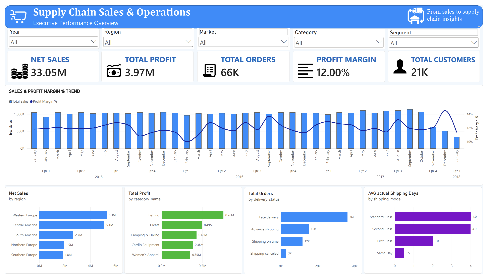
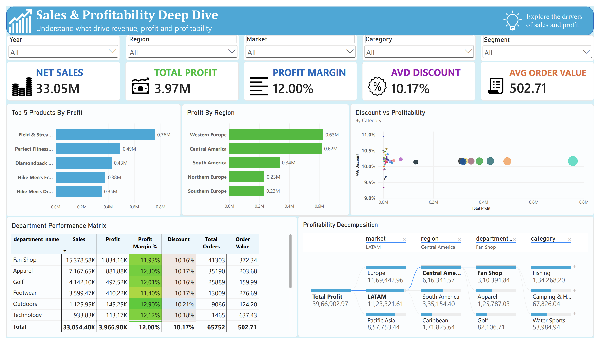
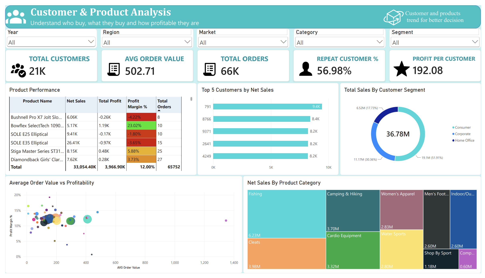
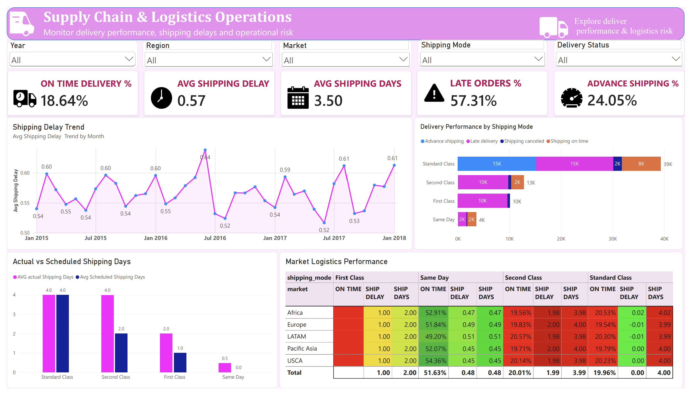
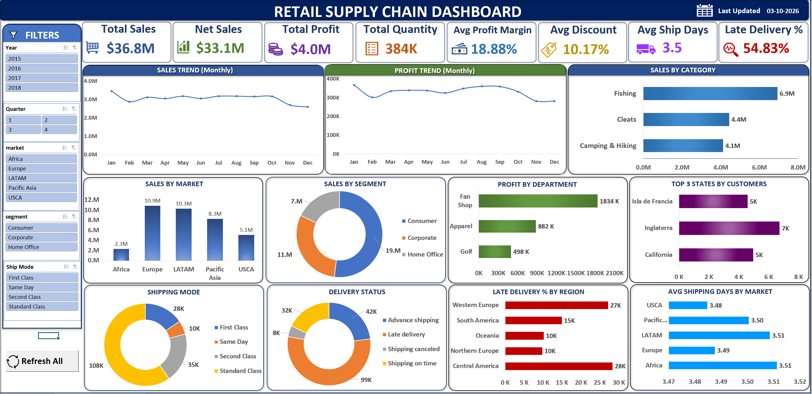
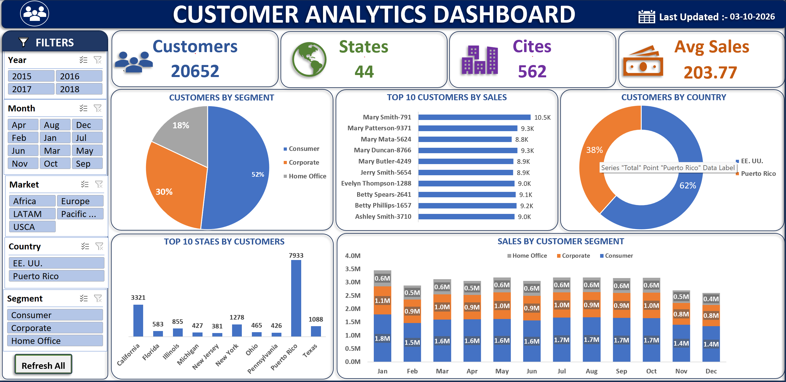
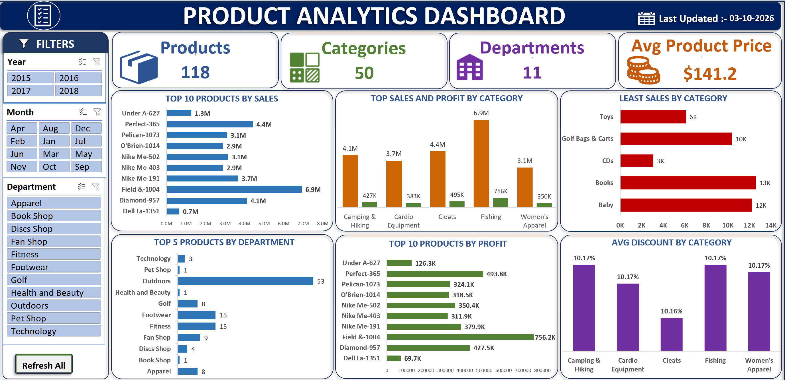
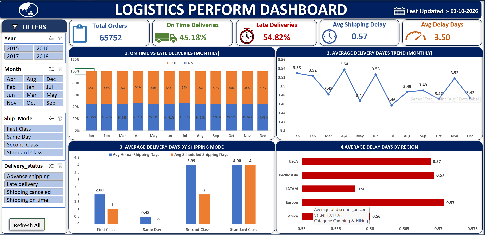

# Retail Supply Chain Analytics

An end-to-end **Retail Supply Chain Analytics** project built using **SQL Server, Power BI, and Excel**.

The project transforms raw retail order data into a structured analytical data warehouse using a **Bronze → Silver → Gold architecture**, followed by business-ready reporting for analyzing sales, profitability, customers, products, and supply chain operations.

---

## 📌 Project Overview

Retail businesses generate large volumes of transactional data across customers, products, orders, locations, sales, and logistics operations.

The objective of this project is to build an end-to-end analytics solution that transforms raw operational data into reliable, business-ready information that can support decision-making across:

- Sales & profitability
- Customer performance
- Product performance
- Inventory-related analysis
- Order fulfillment
- Shipping performance
- Delivery delays
- Regional and market performance

The project combines **data engineering, SQL analytics, dimensional modeling, and business intelligence** into a single workflow.

---

## 🎯 Project Objectives

The main objectives of this project are to:

- Build a structured SQL Server data warehouse
- Implement a **Bronze, Silver, and Gold** data architecture
- Clean, standardize, validate, and deduplicate raw data
- Design a **star schema** for analytical reporting
- Create reusable business-ready SQL views
- Analyze sales and profitability
- Analyze customer and product performance
- Evaluate shipping and delivery performance
- Build interactive Power BI dashboards
- Create supporting Excel analysis
- Translate operational data into actionable business insights

---

# 🏗️ Solution Architecture

```text
                    Raw CSV Dataset
                          │
                          ▼
                  ┌───────────────┐
                  │  Bronze Layer │
                  │  Raw Data     │
                  └───────┬───────┘
                          │
                     Data Cleaning
                     & Transformation
                          │
                          ▼
                  ┌───────────────┐
                  │  Silver Layer │
                  │ Cleaned Data  │
                  └───────┬───────┘
                          │
                    Dimensional
                      Modeling
                          │
                          ▼
                  ┌───────────────┐
                  │   Gold Layer  │
                  │ Star Schema   │
                  └───────┬───────┘
                          │
                          ▼
                Business-Ready View
                  gold.vw_dashboard
                          │
                 ┌────────┴────────┐
                 ▼                 ▼
             Power BI            Excel
                 │
                 ▼
        Business & Supply Chain
             Insights
```

---

# 🗄️ Data Warehouse Architecture

The data warehouse follows a three-layer architecture.

### 🥉 Bronze Layer

The Bronze layer stores the raw data as received from the source CSV file.

**Purpose:**

- Preserve raw source data
- Provide a reliable landing layer
- Separate source data from transformation logic

Main table:

```text
bronze.order_fulfillment_raw
```

---

### 🥈 Silver Layer

The Silver layer contains cleaned and structured data.

Transformations include:

- Trimming unnecessary whitespace
- Standardizing text values
- Converting data types
- Handling null and blank values
- Validating numeric values
- Validating geographical coordinates
- Standardizing customer segments
- Standardizing order and payment fields
- Deduplicating records
- Separating entities into normalized tables

Main Silver tables:

```text
silver.customers
silver.departments
silver.categories
silver.products
silver.orders
silver.order_items
```

---

### 🥇 Gold Layer

The Gold layer contains business-ready analytical tables organized into a star schema.

### Dimension Tables

```text
gold.dim_customers
gold.dim_products
gold.dim_order_locations
gold.dim_date
```

### Fact Table

```text
gold.fact_order_items
```

The Gold layer uses **surrogate keys** to support analytical relationships and dimensional modeling.

---

# ⭐ Star Schema

The central fact table is:

```text
gold.fact_order_items
```

It connects to the following dimensions:

```text
                 dim_customers
                       │
                       │
dim_date ───── fact_order_items ───── dim_products
                       │
                       │
                dim_order_locations
```

### Fact Table

`fact_order_items` contains analytical measures and transactional information such as:

- Quantity
- Sales
- Net Sales
- Profit
- Profit Margin
- Discount
- Product Cost
- Shipping Days
- Shipping Delay
- Late Delivery Risk

### Dimensions

**Customer Dimension**

Contains customer identity, segment, geographic and location attributes.

**Product Dimension**

Contains product, category, department, price and status information.

**Order Location Dimension**

Contains market, region, country, state, city and postal information.

**Date Dimension**

Contains calendar, month, quarter, year, week and weekend attributes.

---

# 🔄 ETL Process

The project implements an end-to-end ETL workflow.

### 1. Extract

Raw data is loaded from the source CSV file into the Bronze layer using SQL Server `BULK INSERT`.

### 2. Transform

The Silver layer performs data preparation including:

- Cleaning
- Standardization
- Validation
- Deduplication
- Type conversion
- Entity separation

### 3. Load

Cleaned data is loaded into dimensional tables in the Gold layer.

### 4. Reporting

A business-ready SQL view is created:

```text
gold.vw_dashboard
```

This view combines the fact and dimension tables into a reporting-friendly dataset used by BI tools.

---

# 🧹 Data Quality & Transformation

Several data quality techniques were implemented during the transformation process.

### Text Cleaning

```sql
TRIM()
NULLIF()
LOWER()
UPPER()
```

### Data Validation

Examples include:

- Validating latitude and longitude ranges
- Checking non-negative sales and prices
- Validating discount percentages
- Validating shipping-day values
- Validating delivery-risk indicators

### Deduplication

`ROW_NUMBER()` is used to identify and remove duplicate records from source data.

### Date Conversion

Raw date fields are converted into appropriate SQL Server date/time data types.

---

# 📊 Power BI Dashboard

The Power BI report contains four analytical pages designed around different business questions.

## 1. Executive Overview

Provides a high-level view of business and operational performance.

### KPIs

- Net Sales
- Total Profit
- Total Orders
- Profit Margin
- Total Customers

### Analysis

- Sales & Profitability Trend
- Regional Performance
- Category Performance
- Delivery Status
- Shipping Mode Performance



---

## 2. Sales & Profitability

Focuses on understanding revenue and profitability drivers.

### KPIs

- Net Sales
- Total Profit
- Profit Margin
- Average Discount
- Average Order Value

### Analysis

- Top Products by Profit
- Profit by Region
- Discount vs Profitability
- Department Performance
- Profitability Decomposition



---

## 3. Customer & Product Analysis

Analyzes customer behavior and product performance.

### KPIs

- Total Customers
- Average Order Value
- Total Orders
- Repeat Customer %
- Profit per Customer

### Analysis

- Product Performance
- Top Customers by Net Sales
- Customer Segment Performance
- Average Order Value vs Profitability
- Product Category Sales



---

## 4. Supply Chain & Logistics Operations

Focuses on fulfillment and delivery performance.

### KPIs

- On-Time Delivery %
- Average Shipping Delay
- Average Shipping Days
- Late Orders %
- Advance Shipping %

### Analysis

- Shipping Delay Trend
- Delivery Performance by Shipping Mode
- Actual vs Scheduled Shipping Days
- Market Logistics Performance



---

# 📈 Excel Analysis

Excel was also used to provide supporting business analysis and dashboarding.

The Excel analysis includes views covering:

- Executive performance
- Customer analysis
- Product analysis
- Logistics performance

### Excel Screenshots









---

# 💼 Business Questions

The project was designed to answer questions such as:

### Sales & Profitability

- How are sales and profit changing over time?
- Which regions generate the most profit?
- Which departments and categories perform best?
- Which products generate the highest profit?
- How does discounting affect profitability?
- Which areas have negative or weak profitability?

### Customer

- Which customer segments generate the most sales?
- Who are the highest-value customers?
- What is the average order value?
- What percentage of customers are repeat customers?
- Which customers contribute the most profit?

### Product

- Which products generate the highest sales?
- Which products are most profitable?
- Which categories and departments perform best?
- Are some products generating weak or negative profitability?

### Supply Chain & Logistics

- Which shipping modes perform best?
- Where are delivery delays concentrated?
- Which markets have weaker logistics performance?
- How many orders are delivered late?
- How does actual shipping time compare with scheduled shipping time?
- Which regions require operational attention?

---

# 🛠️ Technology Stack

| Technology | Purpose |
|---|---|
| **SQL Server** | Data warehouse and ETL |
| **T-SQL** | Data transformation and analysis |
| **Power BI** | Interactive dashboards |
| **DAX** | Analytical measures |
| **Power Query** | Data preparation |
| **Excel** | Supporting analysis and dashboards |
| **Draw.io** | Architecture and data modeling diagrams |
| **GitHub** | Version control and project documentation |

---

# 📂 Project Structure

```text
retail-supply-chain-analytics/
│
├── README.md
│
├── docs/
│   ├── data_architecture.drawio
│   ├── data_architecture.png
│   ├── data_lineage.drawio
│   ├── data_lineage.png
│   ├── data_model.drawio
│   └── data_model.png
│
├── sql/
│   ├── init_database.sql
│   │
│   ├── bronze/
│   │   ├── ddl_bronze.sql
│   │   └── proc_load_bronze.sql
│   │
│   ├── silver/
│   │   ├── ddl_silver.sql
│   │   └── proc_load_silver.sql
│   │
│   └── gold/
│       ├── ddl_proc_load_gold.sql
│       └── view_gold.sql
│
├── powerbi/
│   ├── RetailSCMPowerBIProject.pbix
│   └── screenshots/
│       ├── executive_overview.png
│       ├── sales_profit.png
│       ├── customer_product.png
│       └── supply_chain.png
│
└── excel/
    ├── RetailSCM_Excel.xlsx
    └── screenshots/
        ├── executive_dashboard.png
        ├── customer_analysis.png
        ├── product_analysis.png
        └── logistics_performance.png
```

---

# ▶️ How to Run the Project

## Prerequisites

Install:

- SQL Server
- SQL Server Management Studio (SSMS)
- Power BI Desktop
- Microsoft Excel

---

## Step 1 — Create the Database

Run:

```text
sql/init_database.sql
```

This creates:

```text
RetailSupplyChainDW
```

with the following schemas:

```text
bronze
silver
gold
```

> ⚠️ **Warning:** The initialization script drops and recreates the database if it already exists. Do not run it against a database containing important data.

---

## Step 2 — Create the Bronze Table

Run:

```text
sql/bronze/ddl_bronze.sql
```

---

## Step 3 — Configure the Source CSV Path

Open:

```text
sql/bronze/proc_load_bronze.sql
```

Update the CSV file path in the `BULK INSERT` statement:

```sql
FROM 'C:\RSCDW Dataset\DataCoSupplyChainDataset.csv'
```

Replace it with the location of your local dataset.

---

## Step 4 — Load the Bronze Layer

Execute:

```sql
EXEC bronze.load_bronze;
```

---

## Step 5 — Create Silver Tables

Run:

```text
sql/silver/ddl_silver.sql
```

Then execute:

```sql
EXEC silver.load_silver;
```

---

## Step 6 — Create and Load Gold Layer

Run:

```text
sql/gold/ddl_proc_load_gold.sql
```

This creates and loads the Gold dimension and fact tables.

---

## Step 7 — Create the Reporting View

Run:

```text
sql/gold/view_gold.sql
```

The final reporting view is:

```text
gold.vw_dashboard
```

This view can then be used as the primary reporting source for Power BI and Excel.

---

# 🔐 Data Considerations

The Bronze layer retains the raw source structure for traceability.

Sensitive source attributes that are not required for analytical reporting are not carried into the downstream Silver and Gold analytical layers.

The Gold layer is designed specifically for business intelligence and reporting purposes.

---

# 🧠 Skills Demonstrated

This project demonstrates practical experience in:

### SQL & Data Engineering

- SQL Server
- T-SQL
- DDL
- Stored Procedures
- BULK INSERT
- CTEs
- Window Functions
- Data Cleaning
- Data Validation
- Deduplication
- ETL Pipelines

### Data Warehousing

- Bronze / Silver / Gold architecture
- Dimensional modeling
- Star schema
- Fact tables
- Dimension tables
- Surrogate keys
- Date dimensions
- Business-ready reporting views

### Business Intelligence

- Power BI
- Power Query
- DAX
- Data Modeling
- Interactive Dashboards
- KPI Design
- Business-oriented Data Visualization

### Business & Supply Chain Analytics

- Sales Analysis
- Profitability Analysis
- Customer Analytics
- Product Analytics
- Order Fulfillment
- Logistics Analytics
- Shipping Performance
- Delivery Performance
- Regional Analysis

---

# 📌 Key Takeaways

This project demonstrates how raw operational data can be transformed into a structured analytical solution:

```text
Raw Data
   ↓
Data Cleaning
   ↓
Data Warehouse
   ↓
Dimensional Model
   ↓
Business-Ready Data
   ↓
Power BI / Excel
   ↓
Business Insights
```

The focus is not only on building dashboards, but on creating the **data foundation required to make those dashboards reliable and useful for business decision-making.**

---

# 👨‍💻 About Me

I'm a **BBA graduate from Shivaji University** building my career in **Data Analytics**, with a particular interest in **Supply Chain & Logistics Analytics**.

My current technical focus includes:

- SQL
- Power BI
- Excel
- Data Modeling
- DAX
- Supply Chain Analytics

I'm interested in opportunities where I can use data to solve business and operational problems.

---

## 📬 Connect With Me

**GitHub:** [github.com/kedarpawarKD](https://github.com/kedarpawarKD)

**LinkedIn:** [linkedin.com/in/kedar-pawar](https://www.linkedin.com/)

---

⭐ If you found this project useful, feel free to explore the repository and dashboards.
