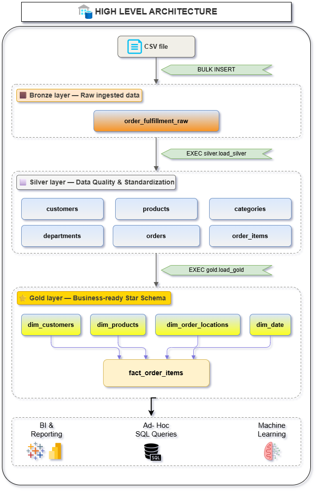
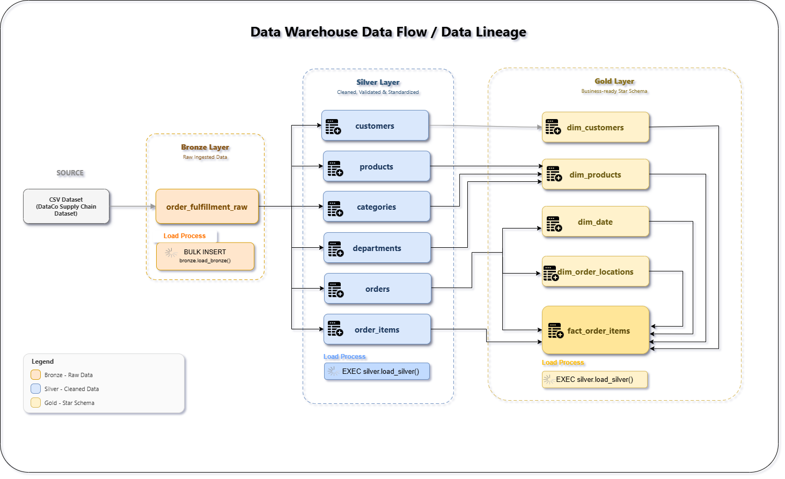
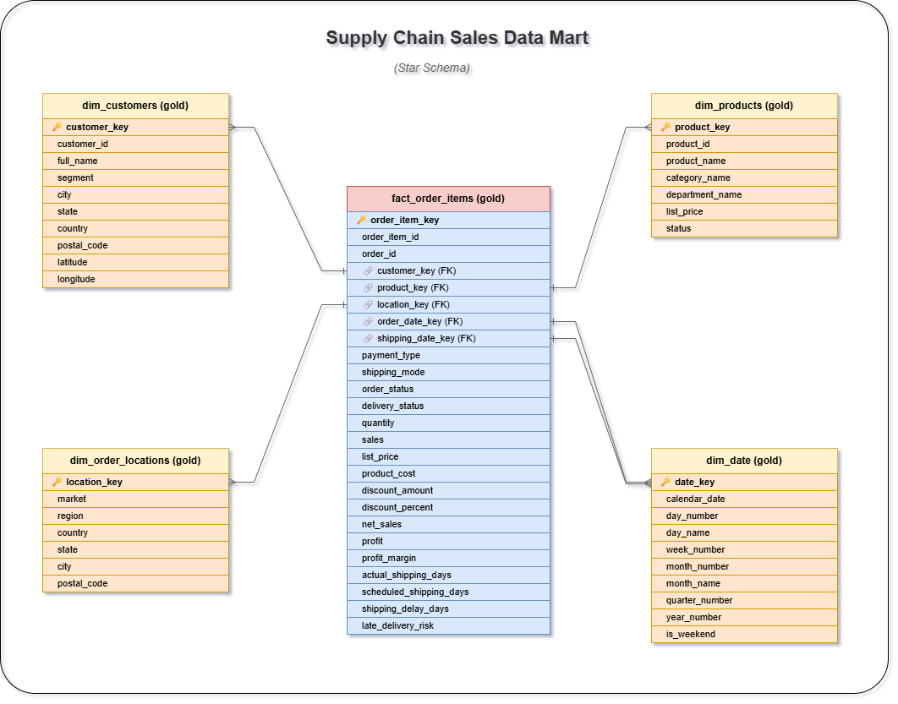

# 📦 Retail Supply Chain Analytics

### End-to-End Data Analytics & Data Warehouse Project using SQL Server, Power BI & Excel

An end-to-end **Retail Supply Chain Analytics** project that transforms raw transactional data into a structured **SQL Server data warehouse**, business-ready analytical datasets, and interactive **Power BI / Excel dashboards**.

The project covers the complete analytics lifecycle:

**Raw Data → ETL → Data Warehouse → Star Schema → SQL Analytics → Power BI & Excel → Business Insights**

---

## 📌 Project Overview

Retail businesses generate large volumes of transactional data across customers, products, orders, sales, locations, and logistics operations.

The objective of this project is to build a complete analytical solution that transforms raw operational data into reliable, business-ready information for decision-making.

The project focuses on:

- 📈 Sales & profitability
- 👥 Customer performance
- 📦 Product performance
- 🚚 Order fulfillment
- 🚛 Shipping & delivery performance
- 🌎 Regional & market analysis
- ⏱️ Delivery delays
- 💰 Discount & profitability analysis

Rather than creating dashboards directly from raw data, the project builds the **data foundation first** through data cleaning, ETL, dimensional modeling, and a business-ready reporting layer.

---

# 🎯 Project Objectives

- Build a structured SQL Server data warehouse
- Implement a **Bronze → Silver → Gold** architecture
- Clean, standardize, validate, and deduplicate raw data
- Separate operational entities into structured tables
- Design a **star schema** for analytical reporting
- Create reusable stored procedures for ETL
- Create a business-ready SQL reporting view
- Analyze sales and profitability
- Analyze customers and products
- Evaluate supply chain and logistics performance
- Build interactive Power BI dashboards
- Create supporting Excel analysis
- Translate operational data into business insights

---

# 🏗️ Solution Architecture

```text
                         RAW SOURCE DATA
                               │
                               ▼
                     ┌──────────────────┐
                     │  BRONZE LAYER    │
                     │                  │
                     │   Raw Data       │
                     └────────┬─────────┘
                              │
                              ▼
                     ┌──────────────────┐
                     │  SILVER LAYER    │
                     │                  │
                     │ Cleaned          │
                     │ Standardized     │
                     │ Validated        │
                     │ Deduplicated     │
                     └────────┬─────────┘
                              │
                              ▼
                     ┌──────────────────┐
                     │   GOLD LAYER     │
                     │                  │
                     │   Star Schema    │
                     │ Business Ready   │
                     └────────┬─────────┘
                              │
                              ▼
                    gold.vw_dashboard
                         /          \
                        /            \
                       ▼              ▼
                  POWER BI          EXCEL
                       │
                       ▼
               BUSINESS INSIGHTS
```

---

# 📐 Project Documentation

The repository includes visual documentation of the complete data engineering and analytics workflow.

## 1. Data Architecture

The architecture diagram shows how raw source data moves through the Bronze, Silver, and Gold layers before reaching the reporting layer.



**Editable file:**  
[Data Architecture – Draw.io](docs/data_architecture.drawio)

---

## 2. Data Lineage

The data lineage diagram documents the flow of data from the original source through transformation layers to the final analytical outputs.



**Editable file:**  
[Data Lineage – Draw.io](docs/data_lineage.drawio)

---

## 3. Star Schema / Data Model

The Gold layer uses a star schema designed for analytical workloads and Power BI reporting.



**Editable file:**  
[Data Model – Draw.io](docs/data_model.drawio)

---

# 🗄️ Data Warehouse Architecture

The data warehouse consists of three logical layers.

## 🥉 Bronze Layer — Raw Data

The Bronze layer acts as the landing layer for the original source data.

### Purpose

- Preserve raw source data
- Maintain source-level traceability
- Separate raw data from transformation logic
- Provide a reliable starting point for ETL

### Main Table

```text
bronze.order_fulfillment_raw
```

Raw data is loaded using SQL Server `BULK INSERT`.

---

## 🥈 Silver Layer — Cleaned & Standardized Data

The Silver layer transforms raw data into clean, validated, structured entities.

### Key transformations

- Trimming whitespace
- Handling blank values
- Standardizing text
- Converting data types
- Validating numeric values
- Validating geographic coordinates
- Standardizing customer segments
- Standardizing order and payment fields
- Deduplicating records
- Separating entities into normalized tables

### Silver Tables

```text
silver.customers
silver.departments
silver.categories
silver.products
silver.orders
silver.order_items
```

---

## 🥇 Gold Layer — Business-Ready Data

The Gold layer contains dimensional models optimized for analytics.

### Dimension Tables

```text
gold.dim_customers
gold.dim_products
gold.dim_order_locations
gold.dim_date
```

### Fact Table

```text
gold.fact_order_items
```

The Gold layer uses **surrogate keys** to establish relationships between fact and dimension tables.

---

# ⭐ Star Schema

The central fact table is:

```text
gold.fact_order_items
```

It connects to four dimensions:

```text
                         dim_customers
                              │
                              │
                              ▼
dim_date ───────────► fact_order_items ◄────────── dim_products
                              │
                              │
                              ▼
                    dim_order_locations
```

## Fact Table

`gold.fact_order_items` contains transactional and analytical measures including:

- Quantity
- Sales
- Net Sales
- Profit
- Profit Margin
- Product Cost
- Discount
- Shipping Days
- Shipping Delay
- Late Delivery Risk

## Dimension Tables

### 👥 Customer Dimension

Contains customer-related attributes such as:

- Customer identity
- Customer segment
- Geographic information
- Location attributes

### 📦 Product Dimension

Contains:

- Product
- Category
- Department
- Product price
- Product status

### 🌎 Order Location Dimension

Contains:

- Market
- Region
- Country
- State
- City
- Postal information

### 📅 Date Dimension

Contains:

- Date
- Day
- Month
- Quarter
- Year
- Week
- Weekend indicators

---

# 🔄 ETL Pipeline

The project follows an end-to-end ETL workflow.

## 1. Extract

Raw data is loaded from the source CSV dataset into the Bronze layer using:

```sql
BULK INSERT
```

---

## 2. Transform

The Silver layer performs:

```text
Cleaning
   ↓
Standardization
   ↓
Validation
   ↓
Deduplication
   ↓
Data Type Conversion
   ↓
Entity Separation
```

---

## 3. Load

Cleaned Silver data is transformed into the Gold dimensional model.

```text
Silver Tables
      ↓
Dimensions
      +
Fact Table
      ↓
Gold Layer
```

---

## 4. Reporting Layer

A business-ready SQL view combines the Gold fact and dimension tables:

```text
gold.vw_dashboard
```

This provides a simplified analytical dataset for downstream reporting.

---

# 🧹 Data Quality & Transformation

Several data quality techniques are implemented throughout the ETL process.

### Text Cleaning

```sql
TRIM()
NULLIF()
LOWER()
UPPER()
```

### Data Validation

Examples include:

- Validating latitude and longitude
- Validating sales and product prices
- Validating discount percentages
- Validating shipping days
- Validating delivery-risk indicators
- Handling invalid or missing values

### Deduplication

`ROW_NUMBER()` is used to identify duplicate records during transformation.

### Date Handling

Raw date fields are converted into appropriate SQL Server date/time data types.

---

# 📊 Power BI Dashboard

The Power BI report contains **four analytical pages**, each designed around a specific business area.

---

## 1️⃣ Executive Overview

### KPIs

- Net Sales
- Total Profit
- Total Orders
- Profit Margin
- Total Customers

### Analysis

- Sales & Profitability Trend
- Regional Performance
- Category Performance
- Delivery Status
- Shipping Mode Performance


---

## 2️⃣ Sales & Profitability Deep Dive

Designed to understand the major drivers of revenue and profitability.

### KPIs

- Net Sales
- Total Profit
- Profit Margin
- Average Discount
- Average Order Value

### Analysis

- Top 5 Products by Profit
- Profit by Region
- Discount vs Profitability
- Department Performance
- Profitability Decomposition


---

## 3️⃣ Customer & Product Analysis

Designed to understand customer value and product performance.

### KPIs

- Total Customers
- Average Order Value
- Total Orders
- Repeat Customer %
- Profit per Customer

### Analysis

- Product Performance
- Top 5 Customers by Net Sales
- Customer Segment Performance
- Average Order Value vs Profitability
- Category Sales


---

## 4️⃣ Supply Chain & Logistics Operations

Designed specifically around fulfillment and logistics performance.

### KPIs

- On-Time Delivery %
- Average Shipping Delay
- Average Shipping Days
- Late Orders %
- Advance Shipping %

### Analysis

- Shipping Delay Trend
- Delivery Performance by Shipping Mode
- Actual vs Scheduled Shipping Days
- Market Logistics Performance


---

# 📈 Excel Analysis

Excel was used as an additional analytical and reporting layer.

The analysis covers:

- Executive performance
- Customer analysis
- Product analysis
- Logistics performance

### Executive Dashboard


### Customer Analysis


### Product Analysis


### Logistics Performance


---

# 💼 Business Questions

The project is designed to answer practical business questions.

## 📈 Sales & Profitability

- How are sales and profit changing over time?
- Which regions generate the highest profit?
- Which departments and categories perform best?
- Which products generate the highest profit?
- How does discounting affect profitability?
- Which areas have weak or negative profitability?

## 👥 Customer

- Which customer segments generate the most sales?
- Who are the highest-value customers?
- What is the average order value?
- What percentage of customers are repeat customers?
- Which customers contribute the most profit?

## 📦 Product

- Which products generate the highest sales?
- Which products are most profitable?
- Which categories and departments perform best?
- Which products have weak or negative profitability?

## 🚚 Supply Chain & Logistics

- Which shipping modes perform best?
- Where are delivery delays concentrated?
- Which markets have weaker logistics performance?
- How many orders are delivered late?
- How does actual shipping time compare with scheduled shipping time?
- Which regions require operational attention?

---

# 🛠️ Technology Stack

| Technology | Purpose |
|---|---|
| **SQL Server** | Data warehouse & ETL |
| **T-SQL** | Data transformation & analysis |
| **Power BI** | Interactive dashboards |
| **DAX** | Analytical calculations |
| **Power Query** | Data preparation |
| **Excel** | Supporting analysis |
| **Draw.io** | Architecture & data modeling |
| **GitHub** | Version control & documentation |

---

# 📂 Project Structure

```text
retail-supply-chain-analytics/
│
├── README.md
│
├── docs/
│   ├── data_architecture.drawio
│   ├── data_architecture.png
│   ├── data_lineage.drawio
│   ├── data_lineage.png
│   ├── data_model.drawio
│   └── data_model.png
│
├── sql/
│   ├── init_database.sql
│   │
│   ├── bronze/
│   │   ├── ddl_bronze.sql
│   │   └── proc_load_bronze.sql
│   │
│   ├── silver/
│   │   ├── ddl_silver.sql
│   │   └── proc_load_silver.sql
│   │
│   └── gold/
│       ├── ddl_proc_load_gold.sql
│       └── view_gold.sql
│
├── powerbi/
│   ├── RetailSCMPowerBIProject.pbix
│   └── screenshots/
│       ├── executive_overview.png
│       ├── sales_profit.png
│       ├── customer_product.png
│       └── supply_chain.png
│
└── excel/
    └── screenshots/
        ├── executive_dashboard.png
        ├── customer_analysis.png
        ├── product_analysis.png
        └── logistics_performance.png
```

---

# ▶️ How to Run the Project

## Prerequisites

Install:

- SQL Server
- SQL Server Management Studio (SSMS)
- Power BI Desktop
- Microsoft Excel

---

## Step 1 — Create the Database

Run:

```text
sql/init_database.sql
```

This creates:

```text
RetailSupplyChainDW
```

and the following schemas:

```text
bronze
silver
gold
```

> ⚠️ **Warning:** The initialization script drops and recreates `RetailSupplyChainDW`. Do not run it against a database containing important data.

---

## Step 2 — Create the Bronze Table

Run:

```text
sql/bronze/ddl_bronze.sql
```

---

## Step 3 — Configure the CSV Path

Open:

```text
sql/bronze/proc_load_bronze.sql
```

Update the path used by `BULK INSERT`.

Example:

```sql
FROM 'C:\RSCDW Dataset\DataCoSupplyChainDataset.csv'
```

Replace this with the location of your local CSV file.

---

## Step 4 — Load Bronze

Execute:

```sql
EXEC bronze.load_bronze;
```

---

## Step 5 — Create and Load Silver

Run:

```text
sql/silver/ddl_silver.sql
```

Then execute:

```sql
EXEC silver.load_silver;
```

---

## Step 6 — Create and Load Gold

Run:

```text
sql/gold/ddl_proc_load_gold.sql
```

This creates and loads the Gold dimensions and fact table.

---

## Step 7 — Create the Reporting View

Run:

```text
sql/gold/view_gold.sql
```

The final reporting view is:

```text
gold.vw_dashboard
```

This view can be connected to Power BI or Excel for analysis.

---

# 🔐 Data Considerations

The Bronze layer preserves the original source structure for traceability.

Data is then cleaned and transformed through the Silver layer before being exposed through the Gold analytical model.

Source attributes that are not required for downstream analytical reporting are not carried into the analytical model.

The Gold layer is designed specifically for **business intelligence and reporting**.

---

# 🧠 Skills Demonstrated

## SQL & Data Engineering

- SQL Server
- T-SQL
- DDL
- Stored Procedures
- BULK INSERT
- CTEs
- Window Functions
- Data Cleaning
- Data Validation
- Deduplication
- ETL Pipelines

## Data Warehousing

- Bronze / Silver / Gold architecture
- Dimensional modeling
- Star schema
- Fact tables
- Dimension tables
- Surrogate keys
- Date dimension
- Business-ready SQL views

## Business Intelligence

- Power BI
- Power Query
- DAX
- Data Modeling
- KPI Design
- Interactive Dashboards
- Business-oriented Visualization

## Supply Chain Analytics

- Sales Analysis
- Profitability Analysis
- Customer Analytics
- Product Analytics
- Order Fulfillment
- Logistics Analytics
- Shipping Performance
- Delivery Performance
- Regional Analysis

---

# 🔎 Project Workflow

The complete project can be summarized as:

```text
                    SOURCE DATA
                         │
                         ▼
                 ┌──────────────┐
                 │    BRONZE    │
                 │  Raw Data    │
                 └──────┬───────┘
                        │
                        ▼
                 ┌──────────────┐
                 │    SILVER    │
                 │ Clean &      │
                 │ Standardize  │
                 └──────┬───────┘
                        │
                        ▼
                 ┌──────────────┐
                 │     GOLD     │
                 │ Star Schema  │
                 └──────┬───────┘
                        │
                        ▼
               BUSINESS DATASET
                        │
                 ┌──────┴──────┐
                 ▼             ▼
              POWER BI       EXCEL
                 │             │
                 └──────┬──────┘
                        ▼
                BUSINESS INSIGHTS
```

---

# 📌 Key Takeaway

This project demonstrates that effective analytics is not only about creating dashboards.

The complete solution involves:

**Data Engineering → Data Quality → Data Warehousing → Dimensional Modeling → Analytics → Visualization → Business Decision-Making**

The project therefore combines technical data skills with a **business and supply chain perspective** to turn raw operational data into a structured analytical solution.

---

# 👨‍💻 About Me

I'm a **BBA graduate from Shivaji University** building my career in **Data Analytics**, with a particular interest in **Supply Chain & Logistics Analytics**.

My current technical focus includes:

- SQL
- Power BI
- Excel
- Power Query
- DAX
- Data Modeling
- Supply Chain Analytics

I'm interested in **Data Analyst and Business Analyst opportunities** where I can use data to solve business and operational problems.

---

## 🔗 Connect

**GitHub:**  
https://github.com/kedarpawarKD

**Project Repository:**  
https://github.com/kedarpawarKD/retail-supply-chain-analytics

---

⭐ **If you found this project useful, feel free to explore the repository and dashboards.**
